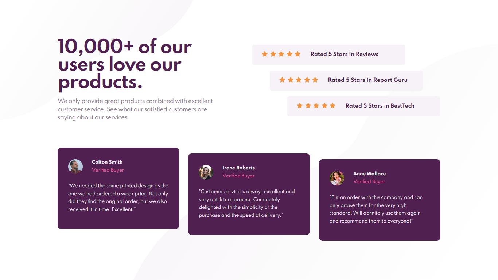

# Frontend Mentor - Social proof section solution

This is a solution to the [Social proof section challenge on Frontend Mentor](https://www.frontendmentor.io/challenges/social-proof-section-6e0qTv_bA). Frontend Mentor challenges help you improve your coding skills by building realistic projects. 

## Table of contents

- [Overview](#overview)
  - [The challenge](#the-challenge)
  - [Screenshot](#screenshot)
  - [Links](#links)
- [My process](#my-process)
  - [Built with](#built-with)
  - [What I learned](#what-i-learned)
  - [Continued development](#continued-development)
  - [Useful resources](#useful-resources)
- [Author](#author)
- [Acknowledgments](#acknowledgments)

## Overview

### The challenge

Users should be able to:

- View the optimal layout for the section depending on their device's screen size

### Screenshot



### Links

- Solution URL: [Add solution URL here](https://github.com/MYSTYX7/social-proof-section)
- Live Site URL: [Add live site URL here](https://festive-calam-3f20c6.netlify.app/)

## My process

### Built with

- Semantic HTML5 markup
- SCSS custom properties
- Flexbox 

### What I learned

Used SCSS for the first time and definitely saved a large amount of time. 

```scss
$font-size: 15px;

@mixin review-box{
            box-sizing: border-box;
            border-radius: 10px;
            background-color: $dark-magenta;
}
#review-box-1{
            @include review-box;
            margin-bottom: 32px;
}
```
### Useful resources

- [svgbackgrounds.com](https://www.svgbackgrounds.com/how-to-add-svgs-with-css-background-image/) - Helped me with the svg background.
- [sass-lang.com](https://sass-lang.com/guide) - Used for writing styles in SCSS instead of CSS.

## Author

- Frontend Mentor - [@MYSTYX7](https://www.frontendmentor.io/profile/MYSTYX7)
- Twitter - [@mystyx_7](https://www.twitter.com/mystyx_7)
